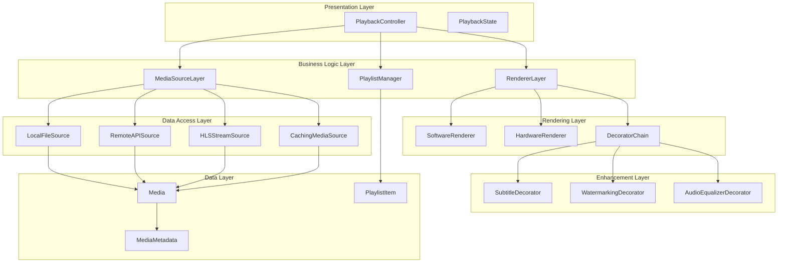
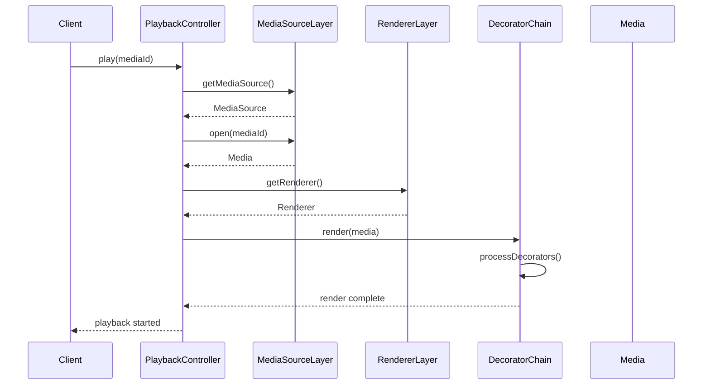

# Alternative UML Diagram - Modular Media Streaming System

## Component-Based Architecture View

This alternative UML diagram focuses on the component relationships and data flow rather than class inheritance.

```mermaid
classDiagram
    %% Core System Components
    class PlaybackController {
        <<Facade>>
        -MediaSource mediaSource
        -Renderer renderer
        -PlaybackState state
        +play(mediaId String) void
        +pause() void
        +stop() void
        +setRenderer(renderer Renderer) void
        +getPlaybackState() PlaybackState
    }
    
    class PlaybackState {
        -String currentMediaId
        -PlaybackStatus status
        -long timestamp
        -Map~String, Object~ properties
        +getCurrentMedia() String
        +getStatus() PlaybackStatus
        +updateStatus(status PlaybackStatus) void
    }
    
    %% Media Source Layer
    class MediaSourceLayer {
        <<Layer>>
        +LocalFileSource localSource
        +RemoteAPISource remoteSource
        +HLSStreamSource hlsSource
        +CachingMediaSource cacheSource
    }
    
    class LocalFileSource {
        -String basePath
        -FileSystem fileSystem
        +open(mediaId String) Media
        +validatePath(path String) boolean
        +getFileInfo(mediaId String) FileInfo
    }
    
    class RemoteAPISource {
        -String apiBaseUrl
        -HttpClient httpClient
        -ApiCredentials credentials
        +open(mediaId String) Media
        +authenticate() boolean
        +getMediaMetadata(mediaId String) Metadata
    }
    
    class HLSStreamSource {
        -String streamBaseUrl
        -StreamProtocol protocol
        -QualityLevel quality
        +open(mediaId String) Media
        +getStreamInfo(mediaId String) StreamInfo
        +switchQuality(level QualityLevel) void
    }
    
    class CachingMediaSource {
        -MediaSource wrappedSource
        -CacheManager cacheManager
        -CachePolicy policy
        +open(mediaId String) Media
        +isCached(mediaId String) boolean
        +evictFromCache(mediaId String) void
        +getCacheStatistics() CacheStats
    }
    
    %% Renderer Layer
    class RendererLayer {
        <<Layer>>
        +SoftwareRenderer softwareRenderer
        +HardwareRenderer hardwareRenderer
        +DecoratorChain decoratorChain
    }
    
    class SoftwareRenderer {
        -CpuProcessor cpuProcessor
        -MemoryManager memoryManager
        -RenderingPipeline pipeline
        +render(media Media) void
        +getCpuUsage() float
        +getMemoryUsage() long
    }
    
    class HardwareRenderer {
        -GpuProcessor gpuProcessor
        -ShaderManager shaderManager
        -HardwareAcceleration acceleration
        +render(media Media) void
        +getGpuUsage() float
        +getShaderInfo() ShaderInfo
    }
    
    %% Decorator Chain
    class DecoratorChain {
        -List~RendererDecorator~ decorators
        -Renderer baseRenderer
        +addDecorator(decorator RendererDecorator) void
        +removeDecorator(decorator RendererDecorator) void
        +getDecoratorCount() int
        +render(media Media) void
    }
    
    class RendererDecorator {
        <<Abstract>>
        #Renderer wrappedRenderer
        -DecoratorConfig config
        +RendererDecorator(wrapped Renderer)
        +render(media Media)* void
        +configure(config DecoratorConfig) void
        +getDecoratorInfo() DecoratorInfo
    }
    
    class SubtitleDecorator {
        -SubtitleManager subtitleManager
        -SubtitleRenderer subtitleRenderer
        -SubtitleConfig config
        +render(media Media) void
        +loadSubtitles(mediaId String) void
        +setSubtitleLanguage(lang String) void
    }
    
    class WatermarkingDecorator {
        -WatermarkManager watermarkManager
        -WatermarkRenderer watermarkRenderer
        -WatermarkConfig config
        +render(media Media) void
        +setWatermarkText(text String) void
        +setWatermarkPosition(position String) void
    }
    
    class AudioEqualizerDecorator {
        -AudioProcessor audioProcessor
        -EqualizerEngine equalizerEngine
        -EQConfig config
        +render(media Media) void
        +setEQLevel(band int, level int) void
        +getEQLevel(band int) int
        +resetEQ() void
    }
    
    %% Playlist Management
    class PlaylistManager {
        -List~Playlist~ playlists
        -PlaylistFactory factory
        -PlaylistSerializer serializer
        +createPlaylist(name String) Playlist
        +addToPlaylist(playlistId String, mediaId String) void
        +removeFromPlaylist(playlistId String, mediaId String) void
        +getPlaylist(playlistId String) Playlist
    }
    
    class CompositePlaylist {
        -String playlistId
        -String name
        -List~PlaylistItem~ items
        -PlaylistMetadata metadata
        +addMedia(mediaId String) void
        +addPlaylist(playlist CompositePlaylist) void
        +getAllMediaIds() List~String~
        +getTotalDuration() long
        +shuffle() void
    }
    
    class PlaylistItem {
        -String itemId
        -ItemType type
        -String mediaId
        -CompositePlaylist subPlaylist
        +getItemType() ItemType
        +getMediaId() String
        +getSubPlaylist() CompositePlaylist
    }
    
    %% Media Entity
    class Media {
        -String mediaId
        -String uri
        -MediaType type
        -MediaMetadata metadata
        -MediaProperties properties
        +getId() String
        +getUri() String
        +getType() MediaType
        +getMetadata() MediaMetadata
        +getProperties() MediaProperties
    }
    
    class MediaMetadata {
        -String title
        -String artist
        -String album
        -long duration
        -String format
        -QualityLevel quality
        +getTitle() String
        +getDuration() long
        +getFormat() String
    }
    
    %% Configuration and State
    class SystemConfig {
        -CacheConfig cacheConfig
        -RendererConfig rendererConfig
        -PlaylistConfig playlistConfig
        -LoggingConfig loggingConfig
        +getCacheConfig() CacheConfig
        +getRendererConfig() RendererConfig
        +updateConfig(config SystemConfig) void
    }
    
    class CacheConfig {
        -int maxCacheSize
        -long maxCacheAge
        -CacheEvictionPolicy evictionPolicy
        -boolean enableCompression
        +getMaxCacheSize() int
        +getEvictionPolicy() CacheEvictionPolicy
    }
    
    %% Relationships
    PlaybackController --> PlaybackState : manages
    PlaybackController --> MediaSourceLayer : uses
    PlaybackController --> RendererLayer : uses
    
    MediaSourceLayer --> LocalFileSource : contains
    MediaSourceLayer --> RemoteAPISource : contains
    MediaSourceLayer --> HLSStreamSource : contains
    MediaSourceLayer --> CachingMediaSource : contains
    
    RendererLayer --> SoftwareRenderer : contains
    RendererLayer --> HardwareRenderer : contains
    RendererLayer --> DecoratorChain : contains
    
    DecoratorChain --> RendererDecorator : contains
    RendererDecorator <|-- SubtitleDecorator : extends
    RendererDecorator <|-- WatermarkingDecorator : extends
    RendererDecorator <|-- AudioEqualizerDecorator : extends
    
    PlaylistManager --> CompositePlaylist : manages
    CompositePlaylist --> PlaylistItem : contains
    
    MediaSourceLayer --> Media : creates
    Media --> MediaMetadata : contains
    
    SystemConfig --> CacheConfig : contains
    PlaybackController --> SystemConfig : uses
```

---

## Layered Architecture View

---

## Component Interaction View

---

## Key Architectural Insights

### 1. **Layered Architecture**
- **Presentation Layer**: User interface and state management
- **Business Logic Layer**: Core functionality and orchestration
- **Data Access Layer**: Media source abstraction
- **Rendering Layer**: Media presentation
- **Enhancement Layer**: Feature additions
- **Data Layer**: Entity management

### 2. **Component Responsibilities**
- **PlaybackController**: Orchestration and facade
- **MediaSourceLayer**: Source abstraction and management
- **RendererLayer**: Rendering strategy management
- **DecoratorChain**: Feature composition
- **PlaylistManager**: Collection management

### 3. **Design Pattern Applications**
- **Facade**: PlaybackController simplifies complex interactions
- **Strategy**: MediaSourceLayer and RendererLayer provide algorithm selection
- **Decorator**: DecoratorChain enables feature composition
- **Composite**: PlaylistItem hierarchy for nested structures
- **Adapter**: CachingMediaSource adapts existing sources

### 4. **Data Flow**
1. **Request**: Client → PlaybackController
2. **Source Selection**: PlaybackController → MediaSourceLayer
3. **Media Retrieval**: MediaSourceLayer → Data Layer
4. **Rendering**: PlaybackController → RendererLayer
5. **Enhancement**: RendererLayer → DecoratorChain
6. **Output**: Enhanced media presentation

This alternative UML provides a **component-based view** focusing on **layered architecture**, **component interactions**, and **data flow** rather than class inheritance relationships.
